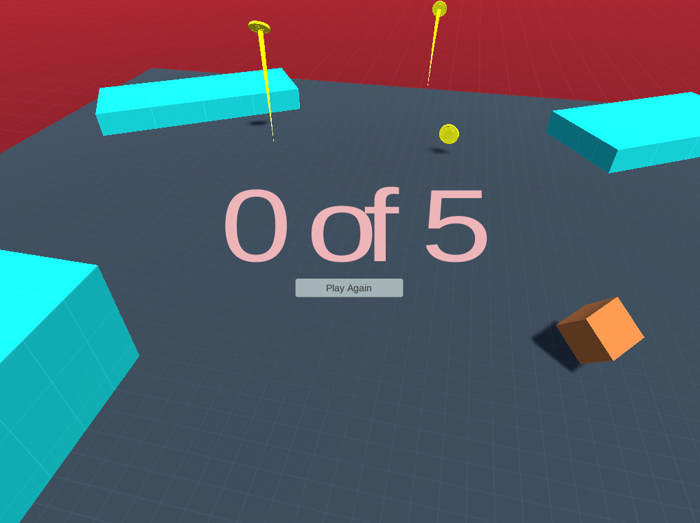
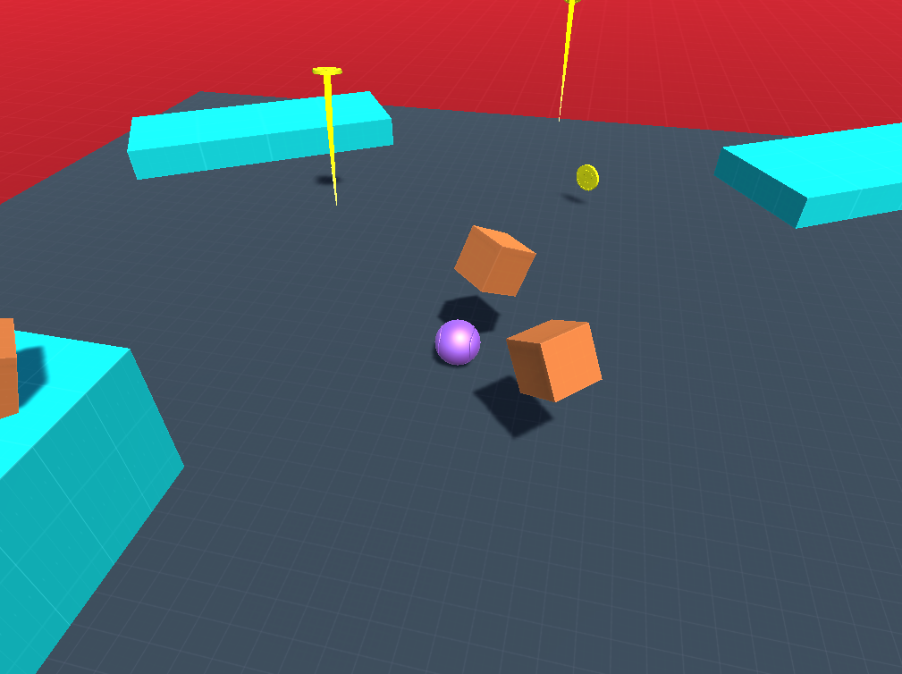
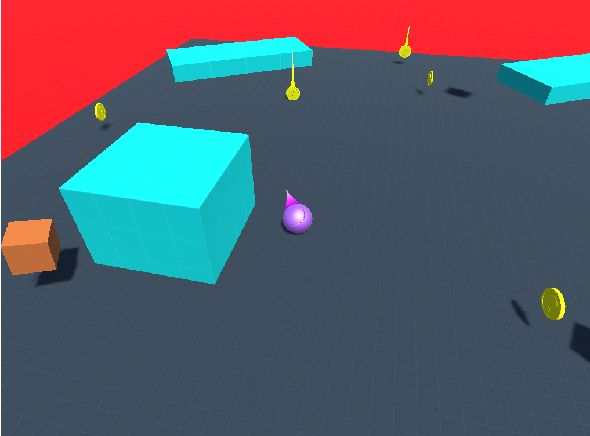

# Roller-Madness

Roller Madness is a platform game built using the Unity3D engine. The player takes control of a ball which is placed on a levitating platform. There are falling coins which can be capture by rolling around on the platform. The player is also surrounded by its arch enemies, the cubes.

The cubes spawn randomly in the 3d space and consistently follow the player trying to kill it, while the player tries to collect the required number of coins to traverse to the next level. Each enemy can be destroyed by making them collide with one another.

The game comprises of two levels, the second posing a higher challenge with the addition of ramps and elevated platforms.

### Instructions
1. Download the .zip file and extract to your system
2. Play by opening the `index.html` file located in the Builds/WebGL folder.

### Screenshots

